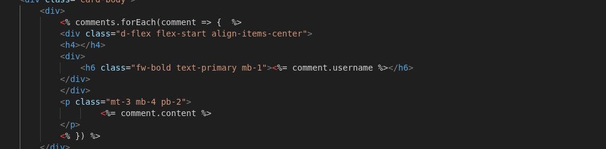
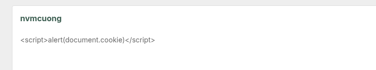
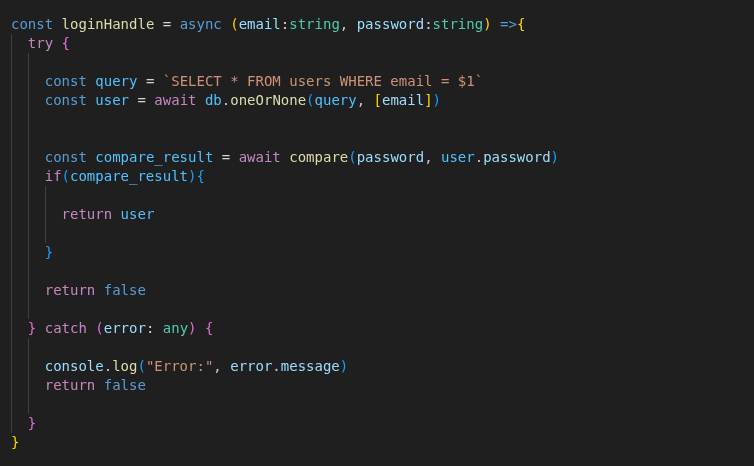
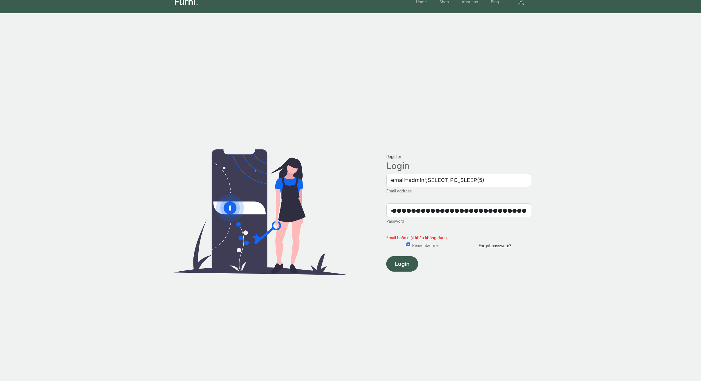
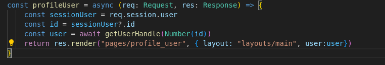
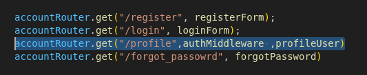
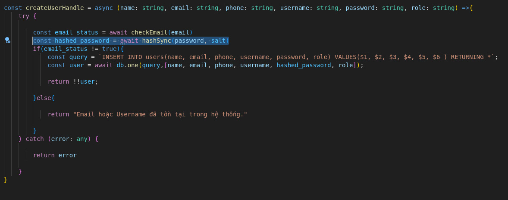

# Patch 
## The vulnerability was patched
- XSS 
- SQLi 
- IDOR 
- Cryptographic Failures

## The changes

### XSS 
Use <%= ... %> instead of <%- ... %> to avoid directly rendering data retrieved from the database

Result:
This makes payloads inoperable.

### SQLi
Avoid direct string concatenation in SQL, this will avoid SQLi

Result: Login failed

### IDOR 
instead of getting user id from url we will get url from session

add middleware so only logged in can access

Result:

### Hashing Password

Use Byscripjs Library to Hash Password

Result: 

