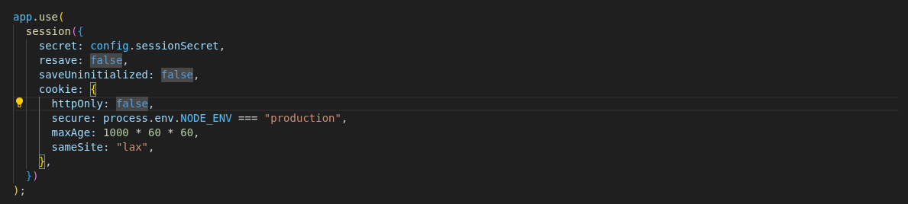
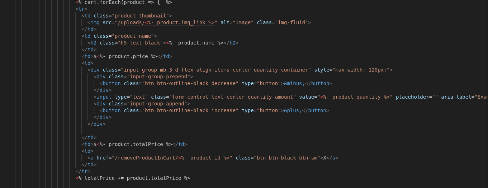
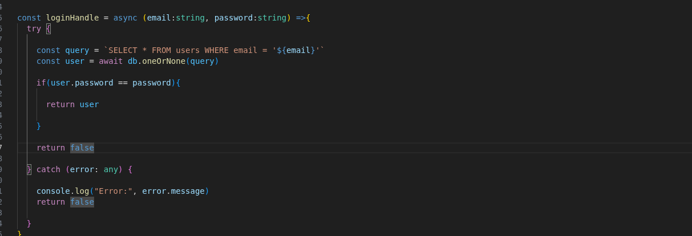
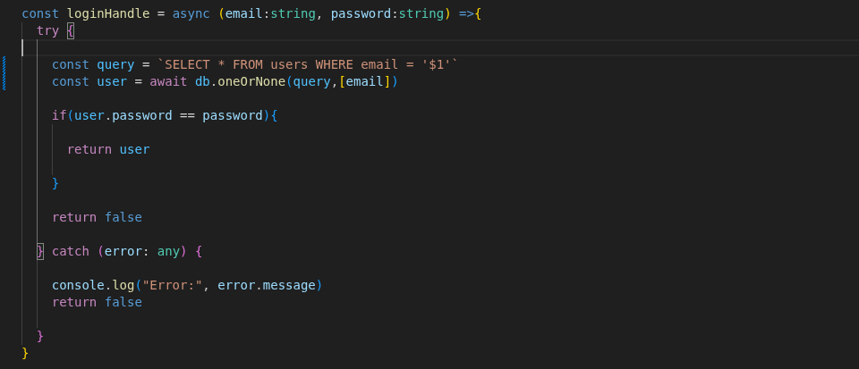
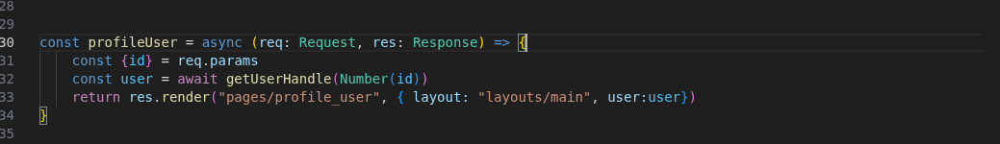
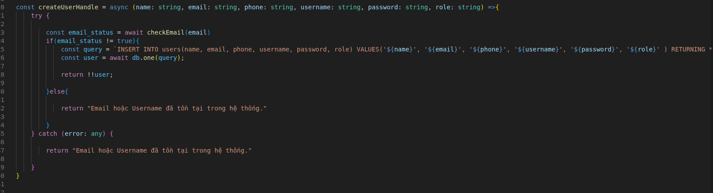
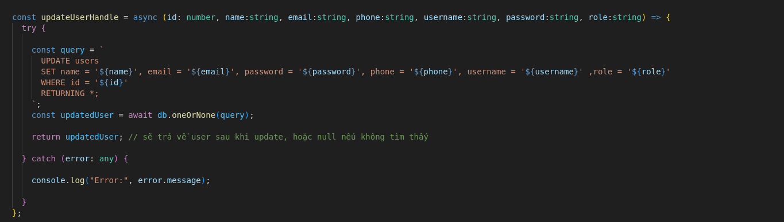
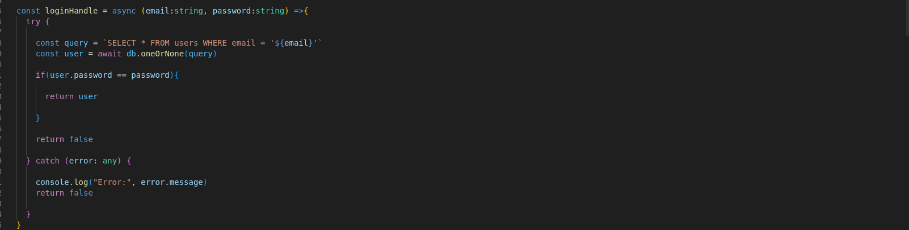

# XSS
XSS usually occurs due to programmer's vulnerability in front-end, so we will audit it in places containing HTML, CSS such as EJS, Jinja, Twig

Hacker can get cookie when http only is false

When rendering data from database, we should not use <%- %>, we should change to <%= %> which will be safer and will not cause XSS error.

# SQLi
SQLi usually occurs in the communication between the backend and the database, so we will audit the parts that communicate with the database.

Raw SQL is being used, programmers tend to concatenate strings directly into SQL statements, so it is easy to cause SQLi, 

changing 

# IDOR
IDOR usually occurs due to poor authorization, so we have to audit routes, controller and middleware.

We can change logic to get id from session

# Password Hashing

Register

update user

login 

These are user related functions, their common point is that they do not encrypt passwords, so we need to add password encryption function to them.