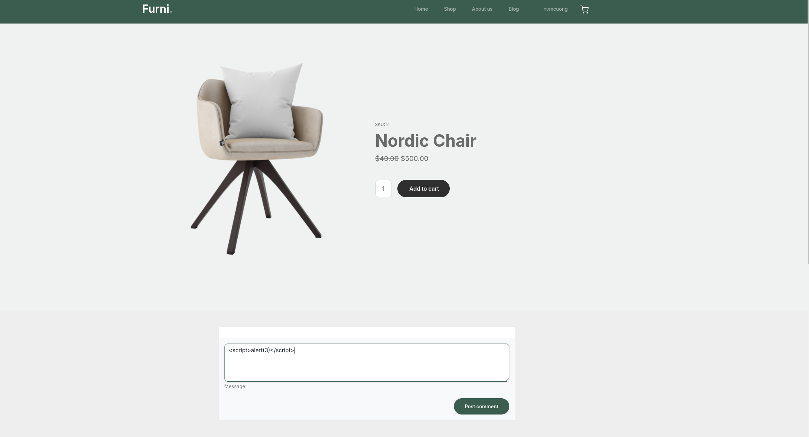
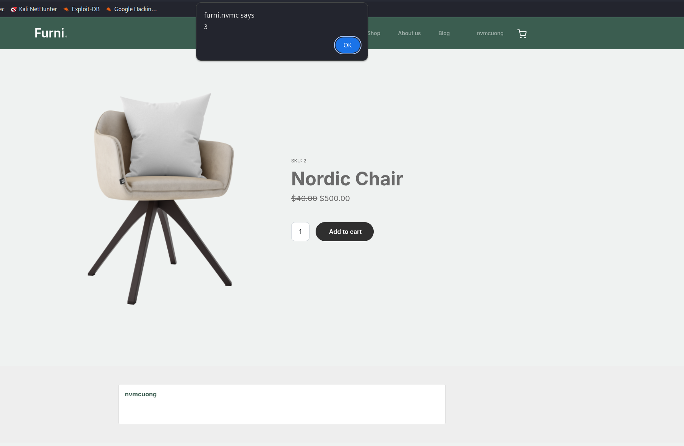
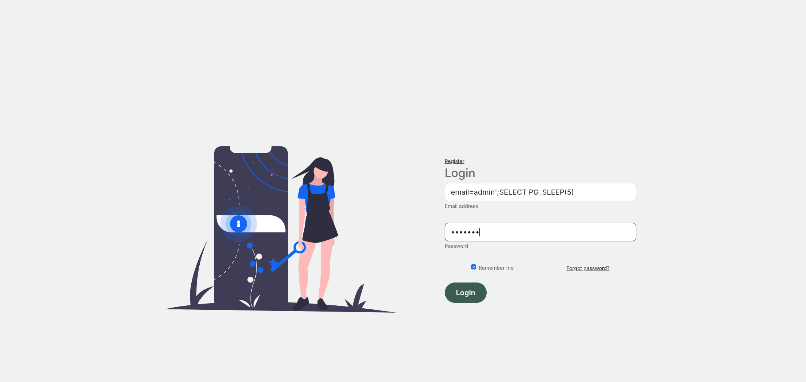
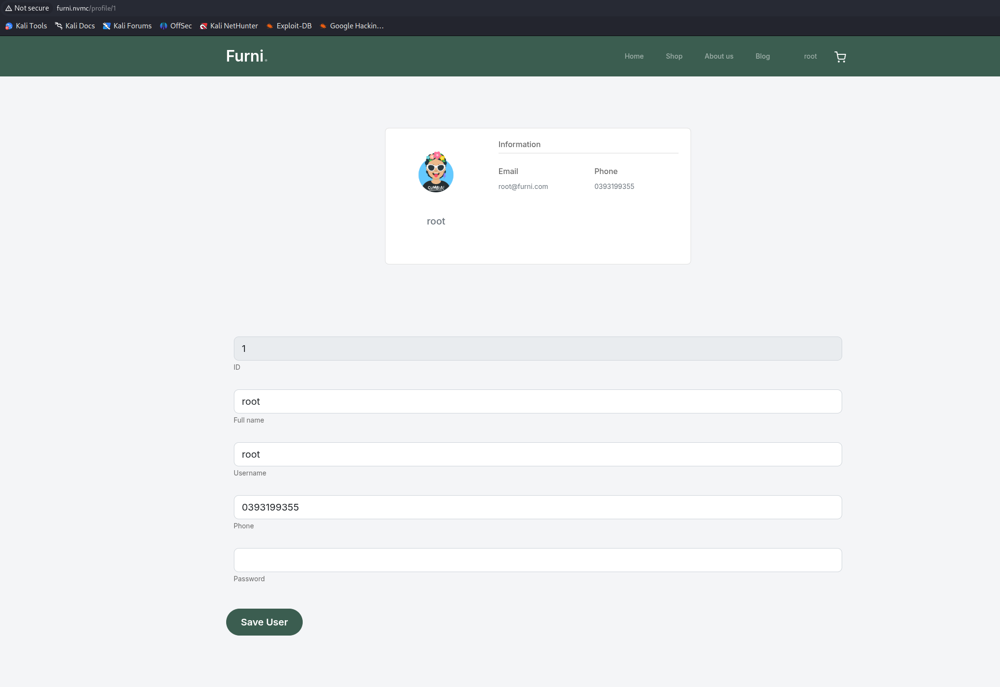
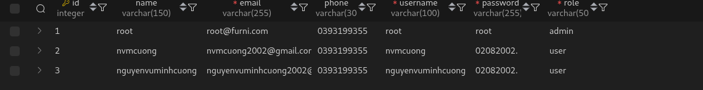

# XSS 
XSS vulnerability detected in user Comment feature <br>

we use payload 
```html
<script>alert(3)</script>
```


result: 


## Consequences of XSS vulnerabilities:

- Stealing cookies and login tokens.

- Impersonating users, account takeover.

- Injecting malicious code or redirecting users.

- Altering website interface or content.

# SQLi (blind)
SQLi vulnerability detected in Login feature

we use payload 
```sql
email=admin';SELECT PG_SLEEP(5) --
```


result: 
=> 5s loading page

## Consequences of SQL Injection (SQLi):

- Data leakage: full database disclosure (user data, cards, emails, etc.).

- Data modification/deletion: unauthorized insertion, alteration, or deletion of data.

- Authentication bypass/account takeover: bypass login mechanisms and gain admin access.

- Server command execution: in some cases can lead to RCE (remote code execution).

- Pivoting: used to move deeper into internal network infrastructure.

- Service disruption/destruction: corrupt or overload the database, causing downtime.

- Financial & legal impact: fines, compensation, and severe reputational damage.

# IDOR 
IDOR vulnerability detected in user profile feature 
we change ID profile


result: 
=> unauthorzed data access

## Consequences of IDOR (Insecure Direct Object Reference):

- Unauthorized data access: users can view others’ records (profiles, invoices, documents).

- Unauthorized data modification/deletion: altering or deleting data that doesn’t belong to them.

- Action hijacking: performing actions on behalf of others (transfers, changing order status).

- Disclosure of sensitive information: exposure of personal data or business secrets.

- Compliance & legal breaches: violating data protection laws, facing fines.

- Reputational & financial damage: loss of customer trust, compensation costs.

- Attack chaining: can enable further attacks (pivoting into internal systems).

# Not encrypting/hashing (with salt) user



## Consequences of not encrypting/hashing (with salt) user accounts in the database

- Plaintext password leakage: if the DB is breached, attackers get passwords without cracking.

- Credential reuse / stuffing: stolen passwords are tried on other services.

- Account takeover & privilege escalation: unauthorized access, admin account compromise, fraudulent transactions.

- Easy automated attacks: bots can rapidly exploit exposed credentials.

- Exposure of associated sensitive data: emails, phone numbers used for phishing/social engineering.

- Breach notification & legal consequences: may violate data protection laws (e.g., GDPR), causing fines and lawsuits.

- Reputational and financial damage: user churn, remediation costs, lost revenue.

- High recovery cost: mass password resets, forensic investigations, security upgrades.